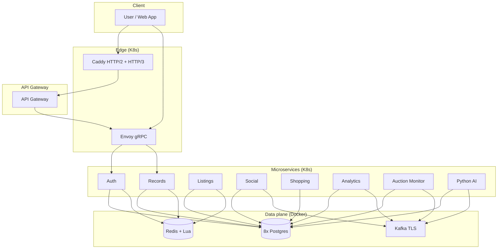
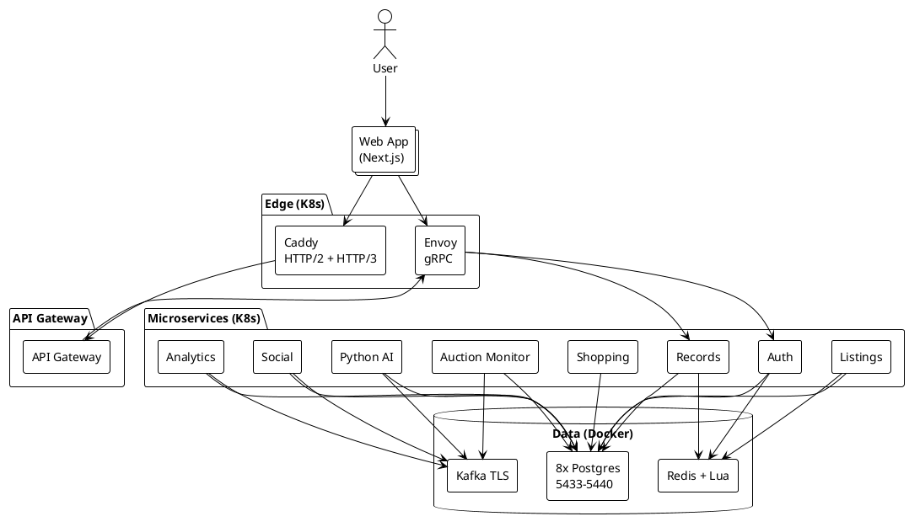

# Architecture Setup, User Case, and User Story

Updated setup (MetalLB optional, Redis+Lua, 8 DBs, Kafka strict TLS), with a concrete user case and user story. For full architecture and justification see ENGINEERING.md.

## High-level setup (current)

- **Kubernetes**: Colima + k3s primary (single node, `--network-address` for bridged networking). API at 127.0.0.1:6443; k3d supported with `REQUIRE_COLIMA=0`. Bring-back: `colima-start-and-ready.sh` / `colima-teardown-and-start.sh`.
- **Edge**: Caddy (HTTP/2, HTTP/3, REST, web); Envoy (gRPC). NodePort or LoadBalancer (MetalLB when `METALLB_ENABLED=1`).
- **Data plane (outside cluster)**: Docker Compose — 8 Postgres (5433–5440), Redis (6379), Kafka (PLAINTEXT 9092, SSL 9093). Pods reach them via host.docker.internal. Restore: `restore-external-postgres-from-backup.sh`; optional hook in `bring-up-external-infra.sh` via `RESTORE_BACKUP_DIR`. Schema: `inspect-external-db-schemas.sh` → `docs/CURRENT_DB_SCHEMA_REPORT.md`.
- **Redis**: JWT cache, search/listings cache; Lua scripts for singleflight, LFU/LRU, rate limiting.
- **Preflight**: ensure-k8s-api, ensure-pgbench-dbs-ready, ensure-ready-for-preflight; then run-preflight-scale-and-all-suites (reissue, scale, wait, 8 suites, optional pgbench/k6, optional in-cluster k6 step 7c).

## User case (what the platform does for a user)

**As a** collector and seller of records (vinyl, etc.),  
**I want** to catalog my collection, track prices and auctions, get recommendations, and optionally interact with other users (forum, messages),  
**So that** I can manage my inventory, spot deals, and list/sell with confidence.

Concrete capabilities:

- **Catalog**: Add and search records (full-text, similarity); metadata and condition.
- **Auth**: Register, login, JWT; optional MFA and OAuth (Google).
- **Shopping / listings**: Cart, checkout, listings, watchlist; availability and pricing.
- **Auction monitor**: Watch auctions; alerts and heat/insights (Python AI).
- **Social**: Forums, direct messages, groups; archive, recall, roles (owner, admin, moderator, member).
- **Analytics**: Searches, predictions; Kafka pipeline to Python AI for seller/buyer insights.

## User story (end-to-end)

**Title:** Collector searches catalog and adds item to watchlist

1. **User** opens the web app (Next.js) and logs in (auth-service, JWT in cookie).
2. **User** searches for "Blue Note" (API Gateway → records-service; Redis cache or Postgres 5433; HTTP/2 or HTTP/3 via Caddy).
3. **User** clicks an item and adds it to watchlist (listings-service, Postgres 5435; optional Redis cache).
4. **Auction monitor** (and Python AI) can use watchlist + listings for heat and insights (Postgres 5435, 5438; Kafka for events).
5. **Strict TLS** end-to-end (dev-root-ca); rotation suite proves zero-downtime cert rotation under load (e.g. 500 req/s H2+H3).

## Diagram (Mermaid — high-level flow)



## Diagram (PlantUML — component view)



## XML (simplified component list)

For tooling or import, a minimal component list in XML form:

```xml
<?xml version="1.0" encoding="UTF-8"?>
<architecture>
  <cluster type="colima-k3s" api="127.0.0.1:6443"/>
  <edge>
    <component name="Caddy" protocols="HTTP/2,HTTP/3" role="TLS termination, REST, web"/>
    <component name="Envoy" protocols="gRPC" role="gRPC proxy"/>
  </edge>
  <ingress>
    <component name="API Gateway" role="JWT, rate limit, HTTP to gRPC"/>
  </ingress>
  <services>
    <service name="auth-service" db="5437"/>
    <service name="records-service" db="5433" cache="Redis"/>
    <service name="listings-service" db="5435" cache="Redis"/>
    <service name="messaging-service" db="5434" messaging="Kafka"/>
    <service name="shopping-service" db="5436"/>
    <service name="analytics-service" db="5439" messaging="Kafka"/>
    <service name="auction-monitor" db="5438" messaging="Kafka"/>
    <service name="python-ai-service" db="5440" messaging="Kafka"/>
  </services>
  <data-plane host="Docker Compose">
    <postgres ports="5433,5434,5435,5436,5437,5438,5439,5440"/>
    <redis port="6379" lua="singleflight,LFU,LRU,rate-limit"/>
    <kafka plaintext="9092" ssl="9093"/>
  </data-plane>
  <optional>
    <metallb description="LoadBalancer for Caddy when METALLB_ENABLED=1"/>
  </optional>
</architecture>
```

## References

- ENGINEERING.md — System architecture, technology stack justification, architecture rationale.
- Runbook.md — Bugs 50–51, Colima API, Reissue, strict TLS.
- docs/SCRIPTS_BREAKDOWN.md — Scripts by component.
- ADR 007 — API and preflight stability; ensure scripts.
