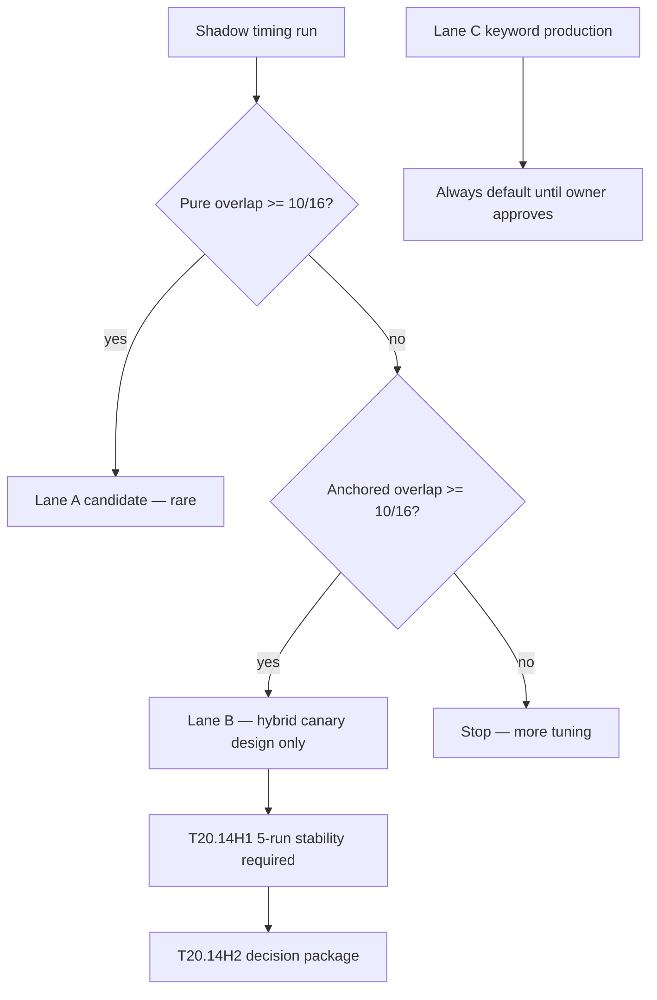

# T20.14H0 — Hybrid vector gate design

## Purpose

G3R established that **pure vector overlap (8/16)** and **anchor-assisted hybrid overlap (16/16)** must be evaluated separately before any rollout or canary planning. This document defines three explicit lanes and their gates.

## Baseline entering H0

| Item | Value |
| ---- | ----- |
| Main SHA | `9c24747` |
| G3R implementation | `cc3fb42` |
| Deploy image | `python-ai-service:t20-p214g3r` |
| HNSW index | present (local/dev) |
| Pure doc/entity overlap >0 | 8/16 |
| Anchored doc/entity overlap >0 | 16/16 |
| True zero-results | 0/16 |
| Shadow p95 | PASS (≤3000 ms) |
| Candidate_fetch p95 | PASS (≤1500 ms) |
| Product telemetry WARNs | 0 |

---

## Lane A — Pure vector

**Definition:** Pure vector means:

- HNSW vector retrieval
- Source/type/profile routing logic
- Entity expansion allowed only when vector-derived (G3 post-selection sibling fetch from shared entity keys)
- **No keyword overlap anchors** (`overlap_anchor_added` must not fire)

**Gate:**

```text
pure_doc_entity_overlap_gt0 >= 10/16
true_zero_results = 0/16
shadow_p95 <= 3000 ms
candidate_fetch_p95 <= 1500 ms
embed_timeouts = 0
```

**Current state (G3R 3-run eval):**

```text
pure_doc_entity_overlap_gt0 = 8/16
Lane A: FAIL
```

Pure vector evidence is insufficient for rollout or canary. Further vector-only tuning would be required to reach ≥10/16 without anchors.

---

## Lane B — Anchor-assisted hybrid

**Definition:** Hybrid means:

- Vector retrieval first (HNSW + profile routing)
- G2R zero-result fallback (keyword anchors on true zero only)
- G3 entity expansion (vector-side sibling fetch)
- G3R keyword overlap anchor top-up (bounded fallback when shadow selected but doc/entity overlap zero)
- Anchors explicitly tagged (`keyword_anchor_added` vs `overlap_anchor_added`)
- Pure vector metrics reported separately in shadow diagnostics and harness

**Gate:**

```text
anchored_doc_entity_overlap_gt0 >= 10/16
pure_doc_entity_overlap_gt0 reported separately
overlap_anchor_added count reported
true_zero_results = 0/16
shadow_p95 <= 3000 ms
candidate_fetch_p95 <= 1500 ms
embed_timeouts = 0
keyword product suites PASS
leakage PASS
rollback plan present
```

**Current state (G3R 3-run eval):**

```text
anchored_doc_entity_overlap_gt0 = 16/16
Lane B: conditionally viable for canary planning only
```

Lane B does **not** authorize production default flip or T20.15 execution. It only permits **design-only** hybrid canary planning after H1 5-run stability confirms gates hold across cold and warm runs.

**Rollback plan (Lane B):**

1. Production retrieval remains keyword — no env flip required for rollback.
2. Shadow/hybrid path is diagnostics-only today; disabling shadow flags reverts to keyword-only evidence.
3. Cluster image rollback: `kubectl set image deployment/python-ai-service app=python-ai-service:t20-p214g3` (last known G3 baseline).
4. Anchor caps enforced in code (`SHADOW_OVERLAP_ANCHOR_MAX=1`, second anchor only if overlap still zero).

---

## Lane C — Production keyword fallback

**Definition:** Production remains:

- Retrieval: **keyword** (default)
- Synthesis: rule-engine / structured panels
- Vector default: **off**
- Shadow diagnostics: opt-in only

**Gate:**

```text
Phase 21 product suites PASS
telemetry WARNs = 0
leakage PASS
```

**Current state:**

```text
Lane C: PASS and remains default
```

Lane C is the shipped path regardless of Lane A/B outcomes until owner explicitly approves a canary design.

---

## Telemetry split (harness + diagnostics)

| Metric | Source field | Meaning |
| ------ | ------------ | ------- |
| Pure doc/entity overlap >0 | `pure_vector_doc_overlap`, `pure_vector_entity_overlap` | Post entity-expansion, pre overlap-anchor |
| Anchored doc/entity overlap >0 | `shadow_plus_anchor_doc_overlap`, `shadow_plus_anchor_entity_overlap` | Final overlap after overlap-anchor top-up |
| Overlap anchors added | `overlap_anchor_added`, `overlap_anchor_count` | G3R hybrid repair count |
| Entity expansion added | `entity_expansion_added_count` | G3 vector-derived sibling fetch |
| Keyword zero-result anchors | `keyword_anchor_added` | G2R true zero-result only |

Harness aggregates: `pure_doc_entity_overlap_gt0_runs`, `anchored_doc_entity_overlap_gt0_runs`, `overlap_anchor_added_count`.

---

## H0 decision flow



---

## Relationship to prior tickets

| Ticket | Contribution |
| ------ | ------------ |
| T20.14F2 | HNSW index; latency headroom |
| T20.14G2 / G2R | Zero-result fix; latency cap restore |
| T20.14G3 | Entity expansion v2 |
| T20.14G3R | Overlap anchor top-up; pure vs anchored telemetry |
| **T20.14H0** | This gate design |
| T20.14H1 | 5-run hybrid stability eval |
| T20.14H2 | Rollout decision package |

---

## Required verdict

```text
Pure vector rollout: NOT APPROVED
Hybrid canary planning: NOT APPROVED yet — requires T20.14H1 5-run stability
Production keyword default: remains approved/default
T20.15: BLOCKED until H1/H2 pass and owner explicitly approves
```
