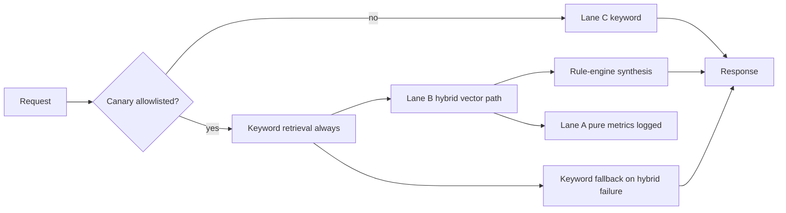

# T20.15A — Hybrid canary design

**Status:** Design complete (docs only — no implementation)  
**Generated:** 2026-06-29  
**Baseline SHA:** `20d88c0` (T20.14H2 decision package)  
**Deploy image:** `python-ai-service:t20-p214g3r`  
**G3R implementation:** `cc3fb42`  
**Parent gate:** T20.14H2 — `T20.15A HYBRID CANARY DESIGN: READY FOR OWNER APPROVAL`

---

## Baseline evidence (H1 5-run stability)

| Metric | Result |
| ------ | ------ |
| Pure doc/entity overlap >0 | **8/16** — FAIL (Lane A) |
| Anchored doc/entity overlap >0 | **16/16** — PASS (Lane B) |
| True zero-results | **0/16** |
| Shadow p95 | 93–1351 ms (≤3000 ms gate) |
| Candidate_fetch p95 | 49–56 ms |
| Product telemetry WARNs | **0** |
| Leakage | **PASS** |
| Production default | **keyword + rule-engine** |

---

## 1. Canary objective

The hybrid canary exists for **evidence collection only** under controlled, allowlisted traffic. It does **not** flip production retrieval default.

| Principle | Requirement |
| --------- | ----------- |
| Purpose | Measure hybrid retrieval quality, latency, overlap, and fallback behavior in live requests — not to ship vector as default |
| Production default | **Keyword retrieval + rule-engine synthesis** remains for all non-canary traffic |
| Fallback | Keyword path must always run and remain the authoritative fallback |
| Approval boundary | T20.15A is design-only; **T20.15B implementation requires explicit owner approval** |
| Pure vector | Lane A metrics are **diagnostic only** — never used to approve production rollout |

```text
Hybrid canary ≠ vector rollout
Hybrid canary = bounded evidence lane for Lane B (anchored hybrid)
```

---

## 2. Canary lanes

Three lanes from T20.14H0 apply unchanged:

### Lane C — Production keyword default

| Attribute | Value |
| --------- | ----- |
| Retrieval | `retrieve_chunks` (keyword) |
| Synthesis | `rule-engine` |
| Traffic | All users when canary off; non-allowlisted users when canary on |
| Gate | Phase 21 product suites PASS, telemetry WARNs = 0, leakage PASS |
| Status | **Approved and default** |

### Lane B — Hybrid anchored canary

| Attribute | Value |
| --------- | ----- |
| Retrieval | HNSW vector + G2R/G3/G3R pipeline (entity expansion + bounded overlap anchors) |
| Synthesis | Rule-engine over hybrid-selected chunks; keyword chunks retained for fallback |
| Traffic | Allowlisted users only (T20.15B+) |
| Gate | anchored overlap ≥10/16, true zero-results = 0, latency ≤3000 ms p95, leakage PASS |
| Status | **Design approved; implementation blocked until T20.15B** |

### Lane A — Pure vector diagnostic metrics only

| Attribute | Value |
| --------- | ----- |
| Purpose | Report `pure_vector_doc_overlap` / `pure_vector_entity_overlap` without overlap anchors |
| Use | Telemetry and dashboards only |
| Gate | Reported separately; **not used for canary approval** |
| Current | 8/16 — FAIL |



---

## 3. Feature gates / env gates

All gates default **off**. No gate may be enabled globally in T20.15B without allowlist.

| Env variable | Default | Purpose |
| ------------ | ------- | ------- |
| `AI_RAG_HYBRID_CANARY` | `0` | Master switch; `1` enables hybrid canary path (allowlist still required) |
| `AI_RAG_HYBRID_CANARY_USER_ALLOWLIST` | `` (empty) | Comma-separated user IDs; empty = no canary traffic even if master is `1` |
| `AI_RAG_HYBRID_CANARY_PERCENT` | `0` | Percentage rollout; **must remain 0** until T20.15E after allowlist canary passes |
| `AI_RAG_HYBRID_REQUIRE_KEYWORD_FALLBACK` | `1` | When `1`, keyword retrieval always runs; hybrid failure returns keyword summary |
| `AI_RAG_HYBRID_LOG_PURE_VECTOR` | `1` | Emit pure-vector overlap metrics separately from anchored hybrid metrics |
| `AI_RAG_HYBRID_ANCHOR_MAX` | `1` | Cap overlap anchors per request (matches G3R `SHADOW_OVERLAP_ANCHOR_MAX`) |

### Existing shadow env (unchanged for non-canary)

| Env variable | Default | Notes |
| ------------ | ------- | ----- |
| `AI_RAG_SHADOW_VECTOR` | `0` | Diagnostics-only shadow; **not** the canary switch |
| Vector production default | off | No change |

### Gate evaluation order (T20.15B implementation)

```text
1. AI_RAG_HYBRID_CANARY == 1
2. user_id in AI_RAG_HYBRID_CANARY_USER_ALLOWLIST (non-empty)
3. AI_RAG_HYBRID_CANARY_PERCENT == 0 (T20.15B/C only)
→ else Lane C keyword
```

---

## 4. Runtime behavior

### Request flow (allowlisted canary user)

1. **Keyword retrieval always runs** (`retrieve_chunks`) — latency and chunks recorded.
2. **Hybrid vector retrieval runs** (`retrieve_chunks_vector_shadow` with G3R pipeline) — only for canary traffic.
3. **Chunk selection for synthesis:**
   - Primary: hybrid-selected chunks (anchored set post entity-expansion + overlap anchors).
   - Keyword chunks retained in response metadata for fallback and overlap comparison.
4. **Synthesis:** Rule-engine templates over selected chunks (no generative Ollama default).
5. **On hybrid failure** (timeout, zero results after fallback, error): return keyword-only summary; increment `hybrid_fallback_count`.

### Metrics logging (per request)

| Field | Source |
| ----- | ------ |
| `pure_vector_doc_overlap` | Pre–overlap-anchor overlap |
| `pure_vector_entity_overlap` | Pre–overlap-anchor overlap |
| `shadow_plus_anchor_doc_overlap` | Final anchored overlap |
| `shadow_plus_anchor_entity_overlap` | Final anchored overlap |
| `overlap_anchor_added` | G3R repair flag |
| `overlap_anchor_count` | Anchors added this request |
| `entity_expansion_added_count` | G3 sibling fetch count |
| `keyword_anchor_added` | G2R zero-result only |
| `hybrid_latency_ms` | Vector path total |
| `keyword_latency_ms` | Keyword path total |
| `hybrid_fallback` | Boolean — keyword used due to hybrid failure |

When `AI_RAG_HYBRID_LOG_PURE_VECTOR=1`, pure metrics are **never** conflated with anchored metrics in dashboards or acceptance gates.

### Non-canary traffic

Unchanged: keyword retrieval, rule-engine synthesis, shadow diagnostics opt-in via existing `AI_RAG_SHADOW_VECTOR` query param / env (diagnostics only, not user-facing hybrid).

---

## 5. Safety rules

| Rule | Enforcement |
| ---- | ----------- |
| No message bodies in retrieval or response | Existing `_chunk_passes_privacy`, message opt-in filters |
| No private OBO message exposure | OBO summaries only; negotiation panels use `obo_offer_summary` |
| No proxy bid fields | `FORBIDDEN_CHUNK_RE` filter; contract audit `no_proxy_max_in_chunks` |
| Leakage scans required | `rp-rp-decontaminate-scan.sh` on every T20.15B/C release candidate |
| Hybrid failure → keyword fallback | `AI_RAG_HYBRID_REQUIRE_KEYWORD_FALLBACK=1` mandatory |
| No generative Ollama as RAG default | Rule-engine synthesis unchanged |
| Anchor cap | `AI_RAG_HYBRID_ANCHOR_MAX=1` (second anchor only if overlap still zero per G3R) |

If hybrid path returns empty, times out, or fails privacy checks: **do not** return partial hybrid evidence; fall back to keyword summary and log `hybrid_fallback=true`.

---

## 6. Canary scope

| Phase | Scope |
| ----- | ----- |
| **T20.15B** | Implement gates; **single allowlisted contract user** (dev/staging owner account) |
| **T20.15C** | Eval on allowlist only — no percentage rollout |
| **T20.15E** | Percentage design **only if** T20.15C/D pass |

### Explicit exclusions

- No public rollout
- No default-on for any hybrid or vector flag
- No `AI_RAG_HYBRID_CANARY_PERCENT > 0` until T20.15E design approved
- No Phase 21 product behavior changes for non-allowlisted users
- No embedding tranches
- No DB/index changes in T20.15B/C

### Suggested allowlist pattern (T20.15B)

```text
AI_RAG_HYBRID_CANARY=1
AI_RAG_HYBRID_CANARY_USER_ALLOWLIST=<contract-test-user-uuid>
AI_RAG_HYBRID_CANARY_PERCENT=0
```

---

## 7. Required metrics

All metrics emitted per canary request and aggregated for T20.15C eval.

| Metric | Type | Gate use |
| ------ | ---- | -------- |
| `keyword_latency_ms` p50/p95 | Latency | Monitor; keyword must not regress for Lane C |
| `hybrid_latency_ms` p50/p95 | Latency | Canary acceptance ≤3000 ms p95 |
| `pure_vector_doc_overlap` | Overlap | **Report only** (Lane A) |
| `pure_vector_entity_overlap` | Overlap | **Report only** (Lane A) |
| `anchored_doc_overlap` | Overlap | Acceptance ≥10/16 equivalent on canary prompt set |
| `anchored_entity_overlap` | Overlap | Acceptance ≥10/16 equivalent on canary prompt set |
| `overlap_anchor_added` count | Counter | Report per request / aggregate |
| `entity_expansion_added` count | Counter | Report per request / aggregate |
| `true_zero_results` | Counter | Must remain 0 |
| `embed_timeouts` | Counter | Must remain 0 |
| `source_diagnostic` | Pass/fail | T19.6C route shadow quality |
| `leakage` | Pass/fail | RP + Playwright leakage checks |
| `answer_quality_score` | Score | Existing evaluator capture (≥3.5 avg target) |
| `hybrid_fallback_count` | Counter | Report; high rate triggers investigation |
| `canary_error_count` | Counter | Report; any spike triggers rollback |

### Dashboard labels (T20.15B+)

```text
lane=c_keyword | lane=b_hybrid_anchored | lane=a_pure_diagnostic
```

---

## 8. Canary acceptance gates (T20.15B/C)

Gates for **T20.15C allowlist eval** and **T20.15D decision package**:

| Gate | Threshold | Lane |
| ---- | --------- | ---- |
| Production keyword suites | PASS | C |
| Hybrid canary p95 latency | ≤3000 ms (or documented stricter threshold in T20.15C) | B |
| True zero-results | 0 | B |
| Anchored doc/entity overlap >0 | ≥10/16 on canary prompt matrix | B |
| Pure vector overlap | **Reported; not used for approval** | A |
| Leakage | PASS | B + C |
| Product Playwright | PASS | C |
| Telemetry WARNs | 0 | C |
| Rollback tested | Manual drill documented | Ops |

**Pure vector overlap failing does not block hybrid canary acceptance** — it is expected at 8/16 per H1. Hybrid approval requires anchored overlap + safety gates only.

---

## 9. Rollback plan

### Immediate rollback (< 5 minutes)

| Step | Action |
| ---- | ------ |
| 1 | Set `AI_RAG_HYBRID_CANARY=0` in deployment env |
| 2 | Clear `AI_RAG_HYBRID_CANARY_USER_ALLOWLIST` |
| 3 | Set `AI_RAG_HYBRID_CANARY_PERCENT=0` |
| 4 | Rollout restart `python-ai-service` deployment |
| 5 | Verify all traffic on Lane C keyword |

```bash
# Illustrative — T20.15B will wire these into deployment manifests
kubectl -n record-platform set env deployment/python-ai-service \
  AI_RAG_HYBRID_CANARY=0 \
  AI_RAG_HYBRID_CANARY_USER_ALLOWLIST= \
  AI_RAG_HYBRID_CANARY_PERCENT=0
kubectl -n record-platform rollout restart deployment/python-ai-service
kubectl -n record-platform rollout status deployment/python-ai-service --timeout=180s
```

### Image rollback (if code regression)

```bash
kubectl -n record-platform set image deployment/python-ai-service \
  app=python-ai-service:t20-p214g3r
kubectl -n record-platform rollout status deployment/python-ai-service --timeout=180s
```

Prior stable pin: `python-ai-service:t20-p214g3r` @ `cc3fb42`.

### Post-rollback verification

```bash
bash scripts/audit-rp-ai-rag-contract.sh
bash scripts/audit-rp-ai-endpoints-contract.sh
bash scripts/rp-rp-decontaminate-scan.sh
./scripts/webapp-playwright-strict-edge.sh e2e/seller-intelligence-ui.spec.ts --grep "Seller intelligence UI"
node scripts/ai-quality-telemetry-report.mjs
```

Expected: keyword contracts PASS, telemetry WARNs 0, no hybrid canary traffic.

---

## 10. Future ticket sequence

| Ticket | Scope | Approval required |
| ------ | ----- | ----------------- |
| **T20.15A** | This design doc | ✅ Complete |
| **T20.15B** | Implement hybrid canary gates, allowlist only | Explicit: `Approved: start T20.15B hybrid canary implementation allowlist-only` |
| **T20.15C** | Allowlist canary eval (prompt matrix + product suites) | After T20.15B deploy |
| **T20.15D** | Canary decision package (continue / stop / percentage design) | After T20.15C |
| **T20.15E** | Optional limited percentage canary **design** | Only if T20.15C/D pass |

No ticket in this sequence may:

- Enable vector as production default
- Set `AI_RAG_HYBRID_CANARY_PERCENT > 0` without T20.15E approval
- Skip rollback drill in T20.15C

---

## Relationship to existing shadow diagnostics

Today `AI_RAG_SHADOW_VECTOR` enables **read-only shadow diagnostics** alongside keyword production — overlap comparison in `shadow_diagnostics` details, not user-facing hybrid answers.

T20.15B hybrid canary is a **separate, stricter path**:

| Aspect | Shadow diagnostics | Hybrid canary |
| ------ | ------------------ | ------------- |
| User-facing | No — details only | Yes — for allowlisted users |
| Env gate | `AI_RAG_SHADOW_VECTOR` | `AI_RAG_HYBRID_CANARY` + allowlist |
| Synthesis | Keyword production unchanged | Hybrid chunks feed rule-engine |
| Fallback | N/A | Keyword mandatory |

Shadow diagnostics remain available for engineering; hybrid canary does not replace or default-on shadow flags.

---

## Required final verdict

```text
Vector rollout: NOT APPROVED
Production default remains keyword
T20.15A hybrid canary design: COMPLETE
T20.15B implementation: NOT STARTED — requires explicit approval
```

---

## References

- `docs/ai-platform/T20-14H0-hybrid-vector-gate-design.md`
- `docs/ai-platform/T20-14H1-hybrid-vector-5run-stability-eval.md`
- `docs/ai-platform/T20-14H2-vector-rollout-decision-package.md`
- `docs/ai-platform/T20-14G3R-overlap-tuning.md`
- `docs/ai-platform/PHASE_21_COPILOT_CONTEXT.md`
